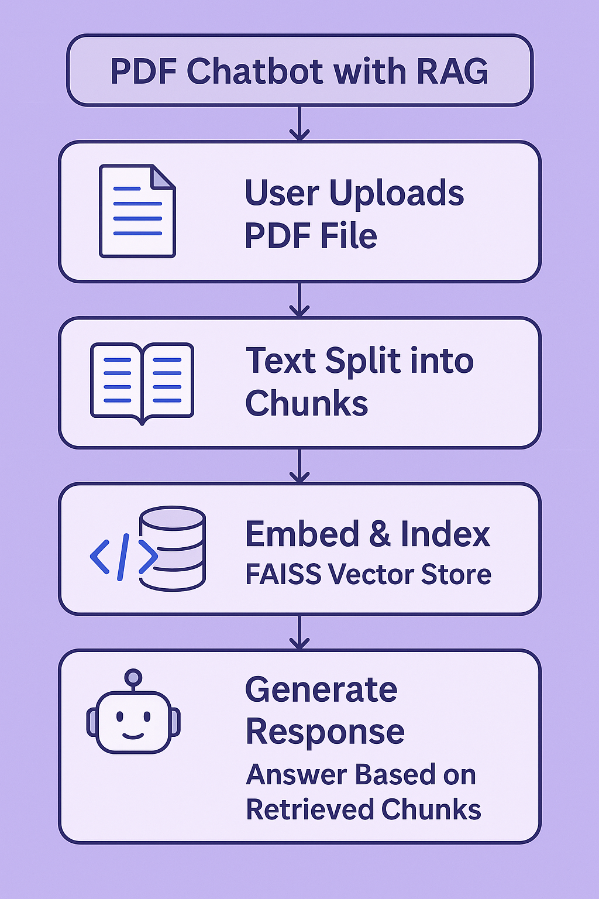

# Pdf_Chat_bot

# 📄 PDF Chatbot with RAG (Retrieval-Augmented Generation)

This project lets you **chat with a PDF** using natural language. Users upload a PDF, ask questions, and receive intelligent responses based on the content — all powered by **LangChain**, **OpenAI**, **FAISS**, and **Streamlit**.

---

## 🚀 Features

- 📁 Upload any PDF document
- 🧠 Chunk and embed content using OpenAI Embeddings
- 🗂 Store and retrieve using FAISS vector DB
- 💬 Ask questions and get accurate, context-aware answers
- 🖥️ Fully interactive **Streamlit UI**
- 🔁 Maintains chat history session-wise

---

## 📸 Architecture Overview

1. **PDF Upload via Streamlit**
2. **Text is Extracted** using `PyPDF2`
3. **Text is Chunked** via LangChain's `RecursiveCharacterTextSplitter`
4. **Embeddings are Generated** using `OpenAIEmbeddings`
5. **Chunks are Stored** in FAISS Vector Store
6. **User Submits a Question**
7. **Relevant Chunks Retrieved** using vector similarity
8. **LangChain + LLM** forms final response
9. **Answer Displayed** in Streamlit chat UI

📌 Refer to the architecture image provided in the project folder for visual understanding.

---

## 🧩 Project Structure

    
